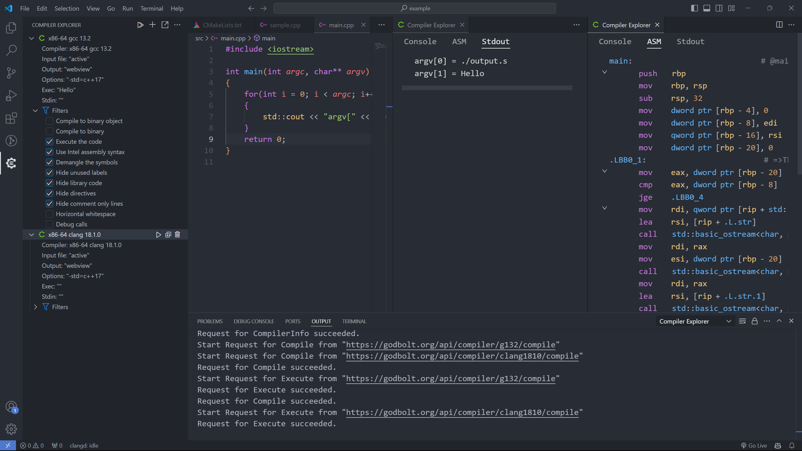
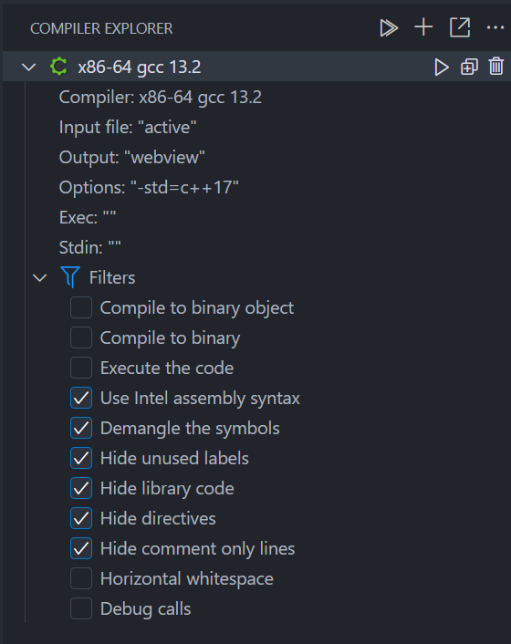
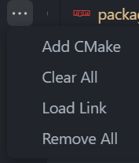
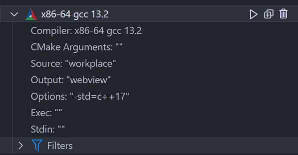
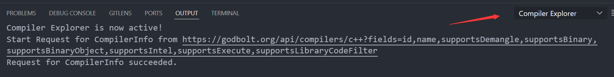

# Compiler Explorer for VSCode

[English](./README.md) | [中文](./README-zh.md)

[Compiler Explorer](https://github.com/compiler-explorer/compiler-explorer) 是一款流行的在线 C++ 编译器，它支持各种平台，各种不同的编译器版本。不仅可以查看执行结果，还可以查看编译器生成的汇编代码。本插件基于 Compiler Explorer 提供的 [API](https://github.com/compiler-explorer/compiler-explorer/blob/main/docs/API.md) 将它集成到 VSCode 中，使得用户可以在 VSCode 中直接使用 Compiler Explorer 的功能。

## 效果展示



## 单文件支持



让我们从上往下以此介绍


这个三个按钮的功能依次是：
- `Compile All`：编译所有的编译器实例
- `Add New`：添加一个新的编译器实例
- `Share Link`：根据当前的编译器实例生成一个链接，并复制到剪贴板


这四个按钮的功能依次是：
- `Add CMake`：添加一个 CMake 编译器实例（后面会细说）
- `Clear All`：关闭所有用于展示的`webview`面板
- `Load Link`：根据输入的链接加载编译器实例的信息
- `Remove All`：删除所有的编译器实例


这个三个按钮的功能依次是：
- `Run`：编译这个编译器实例
- `Clone`：克隆这个编译器实例
- `Remove`：删除这个编译器实例

下面这些用于设置编译器实例的参数：

- `Compiler`：点击右侧的按钮可以选择编译器版本
- `Input`：选择源代码文件，默认是`active`即当前活跃的编辑器
- `Output`：输出编译结果的文件，默认使用`webview`
- `Options`：编译选项，点击右侧按钮可以打开输入框
- `Execute Arguments`：传递给可执行文件的参数
- `Stdin`：用于标准输入的缓冲区
- `Filters`：一些选项

## 多文件支持
使用`Add CMake`按钮可以添加一个 CMake 编译器实例，这个实例可以用于编译多个文件。



大部分选项和单文件的编译器实例一样，额外多出了两个
- `CMake Arguments`：传递给 CMake 的参数
- `Source`：CMakelists.txt 所在的文件夹路径

注意，由于多文件编译需要把所有用到的文件都上传到服务器，所以我们默认会读取你指定的目录下的所有文件（无论后缀名），**所以目前请不要指定文件数量过多的文件夹**。之后可能会添加一些选项允许用户过滤掉一些文件，但是目前还没有。

## 一些用户设置
`compiler-explorer.default.options`：使用`+`号创建编译器时的默认参数
```json
"compiler-explorer.default.options": {
  "type": "object",
  "description": "The default compiler configuration",
  "default": {
    "compiler": "x86-64 gcc 13.2",
    "language": "c++",
    "options": "-std=c++17",
    "exec": "",
    "stdin": "",
    "cmakeArgs": "",
    "src": "workspace",
    "filters": {
      "binaryObject": false,
      "binary": false,
      "execute": false,
      "intel": true,
      "demangle": true,
      "labels": true,
      "libraryCode": true,
      "directives": true,
      "commentOnly": true,
      "trim": false,
      "debugCalls": false
    }
  }
}
```

`compiler-explorer.default.color`：用于指定高亮汇编代码时的颜色
```json
"compiler-explorer.default.color":{
    "symbol": "#61AFEF",
    "string": "#98C379",
    "number": "#D19A66",
    "register": "#E5C07B",
    "instruction": "#C678DD",
    "comment": "#7F848E",
    "operator": "#ABB2BF"
}
```
`compiler-explorer.default.url`：用于打开插件时默认加载的链接，默认是空
```json
"compiler-explorer.default.url": {
  "default": ""
}
```

## 问题反馈
该插件还处于早期阶段，如果你在使用过程中遇到了问题，或者有任何建议，欢迎在 [GitHub](https://github.com/16bit-ykiko/vscode-compiler-explorer) 上留言讨论。或者添加 QQ 群：`662499937` 交流。另外 Output 窗口可能会提供一些有用的信息

