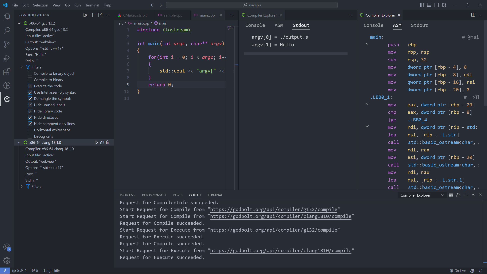
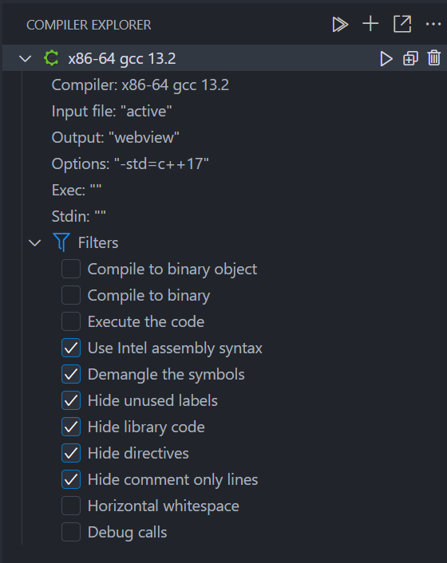
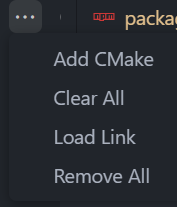
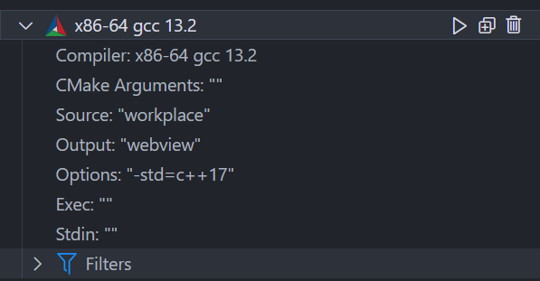
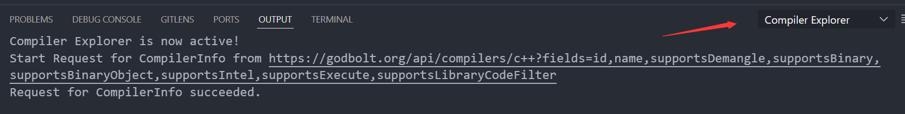

# Compiler Explorer for VSCode
[Compiler Explorer](https://github.com/compiler-explorer/compiler-explorer) is a popular online C++ compiler that supports various platforms and different compiler versions. Not only can you view the execution results, but you can also inspect the assembly code generated by the compiler. This plugin integrates Compiler Explorer into VSCode based on the [API](https://github.com/compiler-explorer/compiler-explorer/blob/main/docs/API.md) provided by Compiler Explorer, allowing users to directly utilize Compiler Explorer's features within VSCode.

## Display



## Single File Support



Let's go through it from top to bottom.


The functions of these three buttons are as follows:
- `Compile All`: Compile all compiler instances.
- `Add New`: Add a new compiler instance.
- `Share Link`: Generate a link based on the current compiler instance and copy it to the clipboard.


The functions of these four buttons are as follows:
- `Add CMake`: Add a CMake compiler instance (explained in detail later).
- `Clear All`: Close all `webview` panels used for display.
- `Load Link`: Load information about the compiler instance based on the input link.
- `Remove All`: Delete all compiler instances.


The functions of these three buttons are as follows:
- `Run`: Compile this compiler instance.
- `Clone`: Clone this compiler instance.
- `Remove`: Delete this compiler instance.

Below are the parameters for setting up compiler instances:

- `Compiler`: Click the button on the right to select the compiler version.
- `Input`: Select the source code file, default is `active` which refers to the currently active editor.
- `Output`: File to output compilation results, default is `webview`.
- `Options`: Compilation options, click the button on the right to open an input box.
- `Execute Arguments`: Arguments passed to the executable file.
- `Stdin`: Buffer for standard input.
- `Filters`: Some options.

## Multiple File Support
Use the `Add CMake` button to add a CMake compiler instance, which can be used to compile multiple files.



Most options are the same as single-file compiler instances, with two additional options:
- `CMake Arguments`: Arguments passed to CMake.
- `Source`: Path to the folder containing the CMakelists.txt.

Note that since compiling multiple files requires uploading all the files used to the server, we default to reading all files (regardless of the extension) under the directory you specify. **So please do not specify a folder with too many files at the moment**. We may add some options later to allow users to filter out some files, but not yet.

## User Settings
`compiler-explorer.default.options`: Default parameters when creating a compiler using the `+` button.
```json
"compiler-explorer.default.options": {
  "type": "object",
  "description": "The default compiler configuration",
  "default": {
    "compiler": "x86-64 gcc 13.2",
    "language": "c++",
    "options": "-std=c++17",
    "exec": "",
    "stdin": "",
    "cmakeArgs": "",
    "src": "workspace",
    "filters": {
      "binaryObject": false,
      "binary": false,
      "execute": false,
      "intel": true,
      "demangle": true,
      "labels": true,
      "libraryCode": true,
      "directives": true,
      "commentOnly": true,
      "trim": false,
      "debugCalls": false
    }
  }
}
```

`compiler-explorer.default.color`：Colors used for highlighting assembly code.

```json
"compiler-explorer.default.color":{
    "symbol": "#61AFEF",
    "string": "#98C379",
    "number": "#D19A66",
    "register": "#E5C07B",
    "instruction": "#C678DD",
    "comment": "#7F848E",
    "operator": "#ABB2BF"
};

```
`compiler-explorer.default.url`：Default link loaded when opening the plugin, default is empty.

```json
"compiler-explorer.default.url": {
  "default": ""
}
```

## Issue Feedback
This plugin is still in its early stages. If you encounter any issues during usage or have any suggestions, feel free to discuss them on [GitHub](https://github.com/16bit-ykiko/vscode-compiler-explorer). Additionally, the Output window may provide some useful information.

